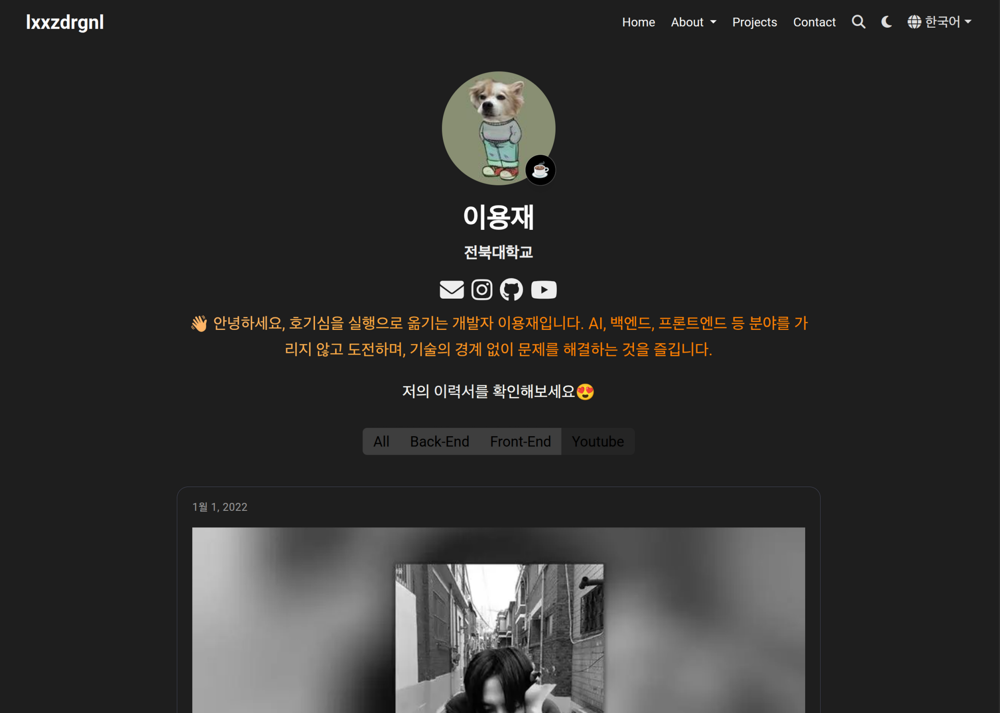

# lxxzdrgnl's Portfolio Website

이 프로젝트는 [Hugo](https://gohugo.io/)와 [Hugo Blox](https://hugoblox.com/) 프레임워크를 사용하여 구축된 개인 포트폴리오 웹사이트입니다.

**[🚀 웹사이트 바로가기](https://lxxzdrgnl.github.io/)**



## ✨ 주요 기술 스택

*   **Framework**: [Hugo](https://gohugo.io/) (v0.124.1)
*   **Theme**: [Hugo Blox](https://hugoblox.com/)
*   **Deployment**: GitHub Pages, Netlify

## 📂 프로젝트 구조

```
.
├── content/         # 사이트의 모든 콘텐츠 (마크다운 파일)
├── config/          # 사이트 설정 파일
├── assets/          # SCSS, 미디어 파일 등
├── static/          # 정적 파일 (폰트, 이미지 등)
├── .github/         # GitHub Actions 워크플로우
└── netlify.toml     # Netlify 배포 설정
```

## 🚀 시작하기

### 사전 요구 사항

이 프로젝트를 로컬에서 실행하려면 [Hugo (Extended version)](https://gohugo.io/installation/)가 설치되어 있어야 합니다.

### 로컬에서 실행하기

1.  **저장소 복제:**
    ```bash
    git clone https://github.com/lxxzdrgnl/lxxzdrgnl.github.io.git
    cd lxxzdrgnl.github.io
    ```

2.  **Hugo 서버 실행:**
    ```bash
    hugo server
    ```

3.  브라우저에서 `http://localhost:1313/` 주소로 접속하여 사이트를 확인합니다.

## ⚙️ 배포

이 프로젝트는 `main` 브랜치에 변경 사항이 푸시될 때마다 GitHub Actions를 통해 자동으로 빌드 및 GitHub Pages에 배포됩니다.